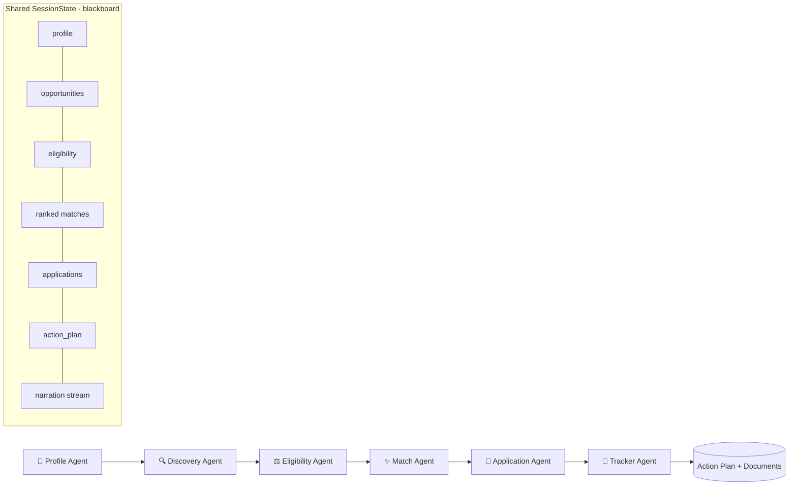

# 🎓 ScholarAI — Autonomous Scholarship & Internship Agent

> A student uploads their résumé **once**. ScholarAI autonomously finds opportunities, checks eligibility with **explainable reasoning**, ranks the best matches, drafts tailored applications, and builds a prioritized action plan.

Built for the **AI Agents & Automation** track.

---

## 🩹 Problem Statement

Every year, **billions of dollars in scholarships and internships go unclaimed** — not because students aren't qualified, but because the process is a research-and-writing marathon:

- Hundreds of fragmented sources, each with different eligibility rules buried in fine print.
- Eligibility is hard to verify: citizenship, GPA floors, field of study, degree level, deadlines.
- Every application needs a *re-tailored* résumé, cover letter, and statement of purpose.
- One missed deadline = a lost opportunity forever.

A single quality application can take **3–6 hours**. The students who need help most — first-generation, low-income, and international applicants — are the ones most likely to give up.

## 💡 Solution Overview

ScholarAI replaces the 6-hours-per-application grind with an **autonomous multi-agent pipeline**. From a single résumé, it:

1. **Extracts** a structured student profile.
2. **Discovers** relevant scholarships and internships.
3. **Screens eligibility** and explains *exactly why* each opportunity is ✅ Eligible, ⚠️ Borderline, or ❌ Not Eligible.
4. **Ranks** the best matches by fit and urgency.
5. **Generates** tailored application documents.
6. **Builds** a prioritized, deadline-aware action plan.

The whole loop runs **live, with a narrated reasoning stream** — and works **even with no API key** thanks to a fully deterministic fallback mode.

---

## ⭐ Key Features

- **Explainable Eligibility Engine** — rule-level verdicts with exact reasons (e.g., *"Requires US Citizenship. Student = International Student."*). The headline differentiator.
- **Three-verdict clarity** — ✅ Eligible / ⚠️ Borderline / ❌ Not Eligible, all visible, with a GPA-tolerance band that surfaces genuine "close calls."
- **Live reasoning narration** — an autonomous-assistant activity stream, not backend logs.
- **Transparent match scoring** — a 0–100 score broken into Academic / Skills / Goals / Urgency.
- **Tailored document generation** — résumé, cover letter, and SOP per opportunity.
- **Deadline-aware action plan** — immediate / upcoming / watchlist prioritization.
- **Provider-agnostic + deterministic fallback** — runs on Groq / Anthropic / Google / OpenAI, or with **no API key at all** (deterministic mode), making the demo bulletproof.
- **One-click Demo Mode** — the Maya Chen profile, same graph, same agents, zero setup.

---

## 🤖 Agent Architecture

ScholarAI is a **blackboard multi-agent system**: agents never talk to each other directly — they read from and write to a single shared `SessionState`, orchestrated by a LangGraph state graph.

| Agent | Responsibility |
|---|---|
| **Profile Agent** | Parse résumé → structured profile (skills, GPA, field, level, citizenship, goals). |
| **Discovery Agent** | Assemble candidate scholarships + internships from a curated knowledge base (+ optional AI search). |
| **Eligibility Agent** | Adjudicate each opportunity rule-by-rule → verdict + exact reasons. *The differentiator.* |
| **Match Agent** | Score and rank eligible/borderline opportunities by weighted fit + urgency. |
| **Application Agent** | Generate tailored résumé, cover letter, and SOP for top picks. |
| **Tracker Agent** | Compute deadlines and produce a prioritized action plan. |

> A seventh **Orchestrator** concept is realized by the LangGraph graph itself, which owns sequencing and state transitions.

---

## 🔄 System Workflow



Every agent appends to a sanitized **narration stream** that the UI renders live as the agent works.

---

## 🛠 Tech Stack

**Backend**
- Python 3.11+
- FastAPI (API + SSE streaming)
- LangGraph (multi-agent orchestration) + LangChain
- Pydantic v2 (typed state & models)
- OpenAI via LangChain (optional — deterministic fallback otherwise)

**Frontend**
- React 18 + Vite
- SSE-driven live narration stream

**Testing**
- pytest / pytest-asyncio (46 tests)

**Deploy**
- Multi-stage `Dockerfile` (frontend built and served by the backend) — one free service

---

## 📁 Project Structure

```
futureAI/
├── README.md
├── Dockerfile                   # one-service build (frontend + backend)
├── render.yaml                  # Render free-tier blueprint
├── .dockerignore  .gitignore  .env.example
├── docs/
│   ├── ARCHITECTURE.md          # Architecture for judges
│   ├── DEPLOYMENT.md            # Free deploy guide (Render / HF / Railway / Fly)
│   └── SUBMISSION.md            # Descriptions, Judge Q&A, demo script, checklist
├── backend/
│   ├── pyproject.toml  requirements.txt
│   └── app/
│       ├── main.py              # FastAPI entrypoint + static SPA serving
│       ├── config.py            # Settings, LLM_PROVIDER, demo reference date
│       ├── llm.py               # get_llm_or_none() — provider-agnostic, key-optional
│       ├── file_extract.py      # PDF / DOCX / TXT résumé extraction
│       ├── state/               # SessionState (shared blackboard)
│       ├── models/              # Pydantic models (profile, opportunity, eligibility, match, ...)
│       ├── agents/              # 6 worker agents + base + orchestrator
│       ├── graph/workflow.py    # LangGraph StateGraph
│       ├── knowledge/           # opportunity_store.py (101 curated opportunities)
│       └── api/routes.py        # REST + SSE endpoints
│   └── tests/                   # 46 passing tests
└── frontend/
    ├── package.json
    ├── vite.config.js           # dev proxies /api → :9000
    └── src/
        ├── screens/             # ProfileUpload, AgentConsole, ApplicationWorkspace
        └── components/          # NarrationStream, OpportunityCard, EligibilityBadge, MatchScore, ProfileSummaryCard
```

---

## ⚙️ Local Setup

### Prerequisites
- Python **3.11+**
- Node.js **18+**

### 1. Backend

```bash
cd backend
python -m venv .venv
# Windows: .venv\Scripts\activate   |   macOS/Linux: source .venv/bin/activate
pip install -r requirements.txt
uvicorn app.main:app --reload --port 9000
```

API now at **http://localhost:9000** (health check: `GET /api/health`).
*(For tests, install dev extras instead: `pip install -e ".[dev]"`.)*

### 2. Environment variables (optional)

```bash
# from the repo root
cp .env.example .env     # Windows: copy .env.example .env
```

Pick a provider with `LLM_PROVIDER`, then set that provider's key:

| Variable | Purpose |
|---|---|
| `LLM_PROVIDER` | `groq` *(recommended — free, fast)* · `anthropic` · `google` · `openai` · `none` · `auto`. `none` runs deterministic fallback (no LLM). |
| `GROQ_API_KEY` / `GROQ_MODEL` | Groq key + model (default `llama-3.3-70b-versatile`). Free at [console.groq.com](https://console.groq.com). |
| `ANTHROPIC_API_KEY` / `ANTHROPIC_MODEL` | Claude (default `claude-haiku-4-5`). |
| `GOOGLE_API_KEY` / `GOOGLE_MODEL` | Gemini (default `gemini-2.5-flash`). |
| `OPENAI_API_KEY` / `OPENAI_ORG_ID` / `MODEL_NAME` | OpenAI. |
| `DEMO_REFERENCE_DATE` | Fixed "today" for deterministic deadline math (default `2026-01-05`). |

> ✅ **The app runs end-to-end with no keys at all** (`LLM_PROVIDER=none` → deterministic profile extraction + template documents). Set a key to get LLM-written extraction and tailored prose. **Groq is the recommended free choice.**

### 3. Frontend

```bash
cd frontend
npm install
npm run dev
```

App now at **http://localhost:5173** (proxies `/api` → `:9000`).

### 4. Run the tests

```bash
cd backend
python -m pytest -q     # 46 passing
```

---

## 🚀 Demo Mode

The fastest path to the full experience — no résumé, no API key required:

1. Start backend (`:8000`) and frontend (`:5173`).
2. Open **http://localhost:5173**.
3. Click **🚀 Run Demo**.
4. Watch ScholarAI process the **Maya Chen** profile end-to-end:
   - Profile extraction → live narration → eligibility screening → match ranking → tailored applications → action plan.

Demo Mode uses the **exact same graph and agents** as a real upload — there is no special execution path.

**Demo profile — Maya Chen:** Undergraduate, Pre-Med, GPA 3.7, International Student; skills in Research, Patient Care, Public Health. She intentionally produces **all three verdicts**, including the canonical ⚠️ Borderline (*GPA 3.7 vs a 3.8 requirement*).

---

## ☁️ Deploy (free, one service)

The repo ships a multi-stage `Dockerfile` that builds the frontend and serves it **from** the FastAPI backend — one container, one URL, no CORS. Deploy free on **Render** (or Hugging Face Spaces / Railway / Fly.io — same Dockerfile):

1. Push this repo to GitHub.
2. On [Render](https://render.com): **New → Blueprint** → pick the repo (it reads `render.yaml`).
3. Set the **`GROQ_API_KEY`** secret in the dashboard.
4. Deploy → you get a public `https://…onrender.com` URL serving the whole app.

Full step-by-step (and alternatives) in **[docs/DEPLOYMENT.md](docs/DEPLOYMENT.md)**.

---

## 👤 Example User Flow

1. **Upload / Demo** → ScholarAI extracts Maya's profile and shows a profile summary card.
2. **Discovery** → it surfaces relevant scholarships and internships.
3. **Eligibility** → cards appear grouped ✅ / ⚠️ / ❌, each with rule-level reasons:
   - ❌ *Gates Millennium Scholars — Requires US Citizen or Permanent Resident. Student = International Student.*
   - ⚠️ *Rural Health Pre-Med Excellence Scholarship — GPA 3.7 is just under the 3.8 requirement (all else passes).*
   - ✅ *AMA Medical Student Scholarship — strong fit.*
4. **Match** → top recommendation surfaces with a transparent score breakdown.
5. **Applications** → tailored résumé / cover letter / SOP generated for top picks.
6. **Action Plan** → *"Apply to Global Health Corps Fellowship first — only 10 days left."*

---

## 📸 Screenshots

> _Add before submission — see `docs/SUBMISSION.md` → "Screenshots needed."_

| View | Placeholder |
|---|---|
| Profile Upload / Demo launch | `docs/screenshots/01-profile-upload.png` |
| Agent Console + live narration | `docs/screenshots/02-agent-console.png` |
| Eligibility cards (✅ ⚠️ ❌) | `docs/screenshots/03-eligibility.png` |
| Match scores + breakdown | `docs/screenshots/04-match-scores.png` |
| Action plan | `docs/screenshots/05-action-plan.png` |

---

## 🔮 Future Improvements

- Live opportunity ingestion (real-time web search + dedup against the curated library).
- Real reminder delivery (email / calendar) for action-plan deadlines.
- One-click "ready to submit" packaging and document export (PDF).
- Broader coverage of MBA/business and non-US opportunities.
- Optional dynamic orchestration (re-planning, follow-up questions for missing fields).

---

## 📄 License

Hackathon submission — for evaluation purposes.
